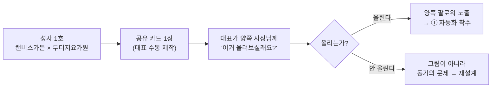

# 성사 공유 카드 (Collab Share Card) — 기획서

날짜: 2026-08-03
상태: 🆕 **대표 검토 대기** — 승인 전. 구현 착수 금지
작성: 기획개발 1팀 (자율 아이데이션 사이클 1)
배경 정본: 미션-문제정의 P5(기록)·M3(자산) · 성사-기록-계측 · 마케팅-실행

---

## 0. 한 줄

콜라보가 성사되면 **두 브랜드가 각자 인스타에 올릴 이미지 한 장**을 만들어 준다.
성사 1건이 **양쪽 팔로워에게 보이는 그림**이 되는, collab5의 유일한 자연 확산 고리다.

---

## 1. 문제

### 1-1. 우리는 재료를 다 갖고 있으면서 출구가 없다

문제정의 P5 원문: **"콜라보가 끝나면 인스타로 휘발된다."**

07-29에 `collabs` 테이블을 만들며 성사를 담을 곳은 생겼다. 그런데 담기만 한다.

| `collabs` 컬럼 | 지금 쓰임 |
|---|---|
| `title` 콜라보 제목 | 소개서 "함께한 콜라보"에만 |
| `year` 연도 | 〃 |
| `description` 설명 | 〃 |
| `photos` 사진(≤5) | 〃 |

**밖으로 내보내는 경로가 0이다.** 새 스키마 없이 만들 수 있는데 안 만들고 있는 상태.

### 1-2. collab5에는 유입 채널이 없다

| 채널 | 현재 |
|---|---|
| 검색(SEO) | 소개서 페이지뿐, 유입 미미 |
| 광고 | **루프 증명 후로 보류**(BM-전략) |
| 씨딩 | 대표 네트워크 — 손으로, 유한 |
| **바이럴** | **없음** |

사장님이 자기 인스타에 올리는 그림은 **우리가 만들 수 있는 유일한 자연 확산**이다.

---

## 2. 제안

`collabs` 한 행을 재료로 **정사각(피드) / 세로(스토리) 이미지**를 생성해
`/my` 성사 탭에서 내려받게 한다.

```
┌──────────────────────────────┐
│                              │
│   ┌────────┐    ┌────────┐   │  ← 각 브랜드 photos[0]
│   │ 사진A  │ ×  │ 사진B  │   │
│   └────────┘    └────────┘   │
│                              │
│      캔버스가든 × 두더지요가원      │  ← 굵게
│                              │
│   헌 옷 조각 수호 오브제 워크숍     │  ← collabs.title
│            2026              │  ← collabs.year
│                              │
│                   collab5 ·  │  ← 구석에 작게
└──────────────────────────────┘
   1080×1080(피드) / 1080×1920(스토리)
```

### ⛔ 로고를 쓰지 않는다 — 08-02에 실측으로 배운 것

`profiles.profile_image`는 **브랜드가 아니라 계정**의 것이다.
지금 **17곳 중 15곳이 대표 계정 소유**라, 로고를 쓰면 **모든 카드가 같은 그림**이 된다
(링크 미리보기에서 똑같이 당했고 `be7882b`에서 사진 우선으로 고쳤다).

→ **브랜드 사진 첫 장(`photos[0]`)을 쓴다.** 사진이 없으면 카드를 만들지 않는다.

---

## 3. 접근안 비교

| | 방식 | 공수 | 지금 적합성 | 판단 |
|---|---|---|---|---|
| ① `next/og` 라우트 | 서버에서 `ImageResponse` 렌더 + `/my`에 [이미지 저장] | 2~3일 (한글 폰트 임베드 포함) | 성사 0~1건이라 **쓸 데가 없다** | 성사 3건 후 |
| ② 클라이언트 Canvas | 브라우저에서 그려 다운로드 | 3~4일 | 폰트·CORS·기기별 렌더 편차 | 기각 |
| **③ 수동 1장** | 대표가 피그마로 첫 장 제작 | **1시간** | 8월 성사 1호에 **바로 쓸 수 있다** | ⭐**추천** |

**추천 = ③ → (반응 보고) ①.**
성사가 0~1건인데 자동화부터 만들면 **아무도 안 쓰는 라우트**가 하나 는다.
먼저 한 장을 만들어 **사장님이 실제로 올리는지**를 본 다음에 자동화한다.

---

## 4. 왜 지금인가

**8월 캔버스가든 × 두더지요가원이 성사 1호로 예정되어 있다**(마케팅-실행).
그 한 건이 카드의 첫 실물이 되고, 동시에 매거진 dry-run과 재료를 공유한다.



---

## 5. 기대 효과 — 정직하게

| 기대 | 현실적 평가 |
|---|---|
| 인스타 유입 | ⚠️ **낮다.** 이미지에는 링크가 안 걸린다. 기대할 수 있는 건 워드마크 인지뿐 |
| 사장님의 자산화(M3) | ⭐ **여기가 진짜 값이다.** 사장님이 **collab5를 자기 자랑에 쓰게 되는 것** |
| 씬 안에서의 신호 | ⭐ 같은 씬의 다른 사장님이 본다 → 다음 소개가 쉬워진다 |

허수를 만들지 않기 위해 **유입은 목표로 잡지 않는다.**

---

## 6. 성공 기준

| 단계 | 기준 |
|---|---|
| 1차 | 성사 1호 양쪽 사장님 **2명 중 1명 이상이 실제로 올린다** |
| 2차 | 올린 게시물에 **"이거 뭐예요?" 반응이 하나라도 있다** |
| 자동화 착수 조건 | 성사 **3건** 누적 + 1차 기준 통과 |

---

## 7. Phase 분할

| Phase | 내용 | 선행 조건 |
|---|---|---|
| **P0** | 대표가 피그마로 성사 1호 카드 1장 제작 → 사장님께 전달 | 성사 1호 발생 |
| P1 | 반응 관찰 (올렸는가 / 반응 있는가) | P0 |
| P2 | `next/og` 라우트 + `/my` 성사 탭 [이미지 저장] | 성사 3건 + P1 통과 |
| P3 | 스토리 규격(1080×1920) 추가 | P2 |

---

## 8. 리스크 & 완화

| 리스크 | 완화 |
|---|---|
| 🚨 **상대 브랜드 사진을 우리가 이미지에 박아 배포** | 성사 기록은 지금 **한쪽(대표)에서** 넣는다. 양쪽 합의가 전제여도 **상대에게 보여주고 쓴다**를 규칙으로 |
| 사장님이 안 올린다 | **첫 장은 대표가 직접 건넨다.** 자동 생성만 해두고 기다리면 아무 일도 안 일어난다 |
| 광고물처럼 보이면 안 올린다 | collab5 워드마크는 **구석에 작게.** 주인공은 두 브랜드 |
| `photos[0]`가 없는 브랜드 | **카드를 만들지 않는다.** 대신 소개서-보강-신청으로 연결 |
| 한글 폰트(P2에서) | `next/og`는 폰트 파일을 직접 넘겨야 한다 — 서브셋 임베드 필요 |

---

## 9. 대표 판정이 필요한 것

1. **③ 수동 1장부터**가 맞나, 아니면 처음부터 ①로 갈까
2. 카드에 **`description`(콜라보 설명)을 넣을까** — 넣으면 정보가 늘고, 빼면 그림이 산다
3. 성사 1호 두 분께 **먼저 물어볼까, 만들어서 보여드릴까**

---

관련: [[미션-문제정의]] · [[성사-기록-계측]] · [[마케팅-실행]] · [[소개서-보강-신청]] · 자매 기획 = `2026-08-03-scene-map-design.md`
