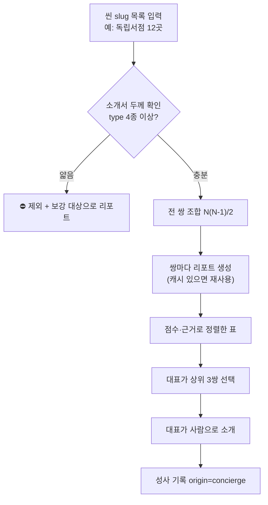

# 씬 콜라보 지도 (Scene Map) — 기획서

날짜: 2026-08-04
상태: 🆕 **대표 검토 대기** — 승인 전. 구현·유료 콜 실행 금지
작성: 기획개발 1팀 (자율 아이데이션 사이클 1)
배경 정본: 미션-문제정의 P1(상상)·P2(탐색) · 콜라보-분석-리포트 · 마케팅-실행(첫 포켓=씬 앵커)

---

## 0. 한 줄

콜라보 리포트를 **거꾸로** 돌린다. 지금은 사용자가 상대를 고른 뒤에야 리포트가 나오지만,
**한 씬(예: 독립서점 12곳)의 모든 쌍을 미리 돌려** 가장 잘 맞는 3쌍을 뽑아낸다.
화면이 아니라 **대표가 첫 포켓에 들고 갈 표 한 장**이다.

---

## 1. 문제

### 1-1. 지금 무슨 일이 일어나나

```
사장님: "콜라보 하고 싶다"
   ↓
   ??? ← 여기서 멈춘다. "누구랑?"에 답하는 것이 제품에 없다
   ↓
(상대를 스스로 고름)
   ↓
[콜라보 분석] → 리포트 → DM
```

리포트 엔진은 **쌍만 주면 답을 낸다.** 그런데 그 쌍을 만드는 일 — 여정에서 가장 어려운 P1(상상)·P2(탐색) —
은 **전부 사장님 몫으로 남아 있다.** 도구는 이미 있는데 입구가 사용자 부담이다.

### 1-2. 그래서 대표에게 무슨 일이 생기나

첫 포켓 성사 1~3건은 **대표가 손으로 만들어야 하는 구간**이다(미션-문제정의 M2).
지금 대표가 쓸 수 있는 조준 도구는 **감(感)뿐이다.** 12곳을 놓고 "누구랑 누구를 붙일까"를
머리로 조합한다. 66가지 조합을 사람이 비교할 수는 없다.

---

## 2. 제안

한 씬의 브랜드 목록(slug N개)을 받아 **모든 쌍 N(N−1)/2개의 리포트를 생성**하고,
**점수·근거와 함께 정렬한 표**를 출력하는 **스크립트**.

| | 값 |
|---|---|
| 산출물 | 터미널 표 + `docs/ideas/scene-map-YYYY-MM-DD.md` |
| 관객 | **대표 1명** (내부 자료) |
| 화면 | **없음** |
| 신규 스키마 | **없음** (기존 `collab_reports` 캐시 그대로 사용) |

### ⭐ 왜 화면을 만들지 않나 — 이 기획의 핵심 결정

리포트에는 **두 개의 확정 정책**이 걸려 있다.

| 정책 | 출처 | 씬 지도가 화면이 되면 |
|---|---|---|
| **리포트는 요청자 전용** — 상대에게는 분석당한 사실조차 노출 안 함 | 대표 명시 비준(07-25) | 66쌍을 화면에 띄우는 순간 전면 재설계 |
| **DM 메시지 주입 안 함** | 콜라보-분석-리포트 | — |

즉 화면으로 만들면 **정책과 싸우는 기획**이 된다.
스크립트로 두면 정책과 **한 번도 마주치지 않는다.** 이건 제품 기능이 아니라 **컨시어지의 조준경**이다.

---

## 3. 접근안 비교

| | 방식 | 공수 | 정책 충돌 | 판단 |
|---|---|---|---|---|
| **① 스크립트** | `scripts/scene-map.mjs` → 표 출력 | **하루** | **없음** | ⭐**추천** |
| ② `/my` 화면 | "내 씬에서 잘 맞는 곳" 섹션 | 1~2주 | **요청자 전용 정책 재설계 필요** | 포켓 10건 이후 재론 |
| ③ 인쇄물 배포 | 씬 지도를 종이로 만들어 모임에서 나눠줌 | 3일 | 🚨**남의 브랜드 분석을 당사자 동의 없이 배포** | 기각 |

**추천 = ①.** 지금 필요한 건 "사장님이 쓰는 기능"이 아니라 **"대표가 첫 성사를 조준하는 도구"**다.
②는 사장님이 주인공인 설계인데, 그건 **씬에 사람이 모인 뒤**에 필요하다.

---

## 4. 동작



### 출력 예시

```
씬: 독립서점 (12곳) · 생성 66쌍 / 유효 58쌍 / thin 제외 8쌍

순위  브랜드 A          브랜드 B            맞물리는 축              첫 아이디어
────────────────────────────────────────────────────────────────────────────
 1    호락호락도서관     캔버스가든          공간·워크숍·업사이클       헌 옷 조각 수호 오브제 워크숍
 2    ...
 3    ...
────────────────────────────────────────────────────────────────────────────
⚠ thin 제외: ○○책방, △△서점 … (보강 신청 대상)
```

---

## 5. 원가·소요

| 항목 | 값 | 근거 |
|---|---|---|
| 리포트 단가 | 25~35원 / 20~25초 | 콜라보-분석-리포트 실측(07-26) |
| DNA 생성 | 3~7원 / 3~8초 (브랜드당 1회) | 〃 |
| **12곳 = 66쌍** | **약 2,300원 / 27분**(직렬) | 66 × 35원 |
| 20곳 = 190쌍 | 약 6,700원 / 80분 | — |

⚠️ **유료 콜이므로 대표 승인 후에만 실행한다.**

---

## 6. 성공 기준

| 단계 | 기준 |
|---|---|
| 1차 (리허설) | 현재 12곳으로 돌려 **상위 3쌍이 대표 눈에 납득되는가** — 안 되면 엔진 문제이므로 여기서 멈춘다 |
| 2차 (실전) | 첫 포켓 씬에서 뽑은 3쌍 중 **1쌍 이상이 실제 대화로 이어지는가** |
| 최종 | 그중 **1건이 성사**(`collabs`, `origin=concierge`) |

⭐ 1차가 **엔진 품질 검증을 겸한다** — 66쌍을 한 번에 보면 지금까지 못 본 품질 편차가 드러난다.

---

## 7. Phase 분할

| Phase | 내용 | 선행 조건 |
|---|---|---|
| **P0** | 현재 12곳으로 리허설 1회 | 대표 승인(유료 콜) |
| **P1** | 첫 포켓 씬 확정 → 그 씬 소개서 **보강 선행** → 본 실행 | 씬 앵커 확정 · 소개서-보강-신청 |
| P2 | 상위 3쌍 컨시어지 소개 → 성사 기록 | P1 |
| P3 | (성사 10건 후) 사장님용 화면으로 승격 검토 | 요청자 전용 정책 재설계 |

---

## 8. 리스크 & 완화

| 리스크 | 완화 |
|---|---|
| 🚨 **thin 가드** — 서로 다른 `type` 4개 미만이면 리포트가 아예 안 나온다. 얇은 소개서가 많으면 표가 빈다 | 실행 **전에** 두께를 먼저 재고, 얇은 곳은 **보강 신청 대상 목록**으로 따로 뽑는다. 씬 지도와 보강은 한 세트 |
| 캐시 오염 우려 | 캐시는 **쌍당 1건 active**, 소개서 변경 시 지문(`input_hash`)으로 자동 stale → 오염 아님 |
| 상위 3쌍이 전부 어색함 | 그 자체가 **엔진 품질 신호**다. 조용히 넘기지 말고 A/B 대상으로 올린다 |
| 유료 콜 오남용 | 스크립트에 **쌍 수 상한 + 실행 전 예상 비용 출력 + 확인 프롬프트** |

---

## 9. 대표 판정이 필요한 것

1. **P0 리허설(현재 12곳, 약 2,300원)을 지금 돌릴까?** — 씬 확정 전이라도 엔진 검증 값이 있다
2. **"잘 맞는다"의 기준을 무엇으로 정렬할까?** — 리포트에 총점이 없다(07-25에 의도적으로 뺌).
   대안 = ⓐ맞물리는 축 개수 ⓑ signature 생존 수 ⓒ정렬 없이 66쌍 전부 보여주기
3. 첫 포켓 씬은 독립서점으로 확정인가

---

관련: [[미션-문제정의]] · [[콜라보-분석-리포트]] · [[소개서-보강-신청]] · [[마케팅-실행]] · [[성사-기록-계측]]
